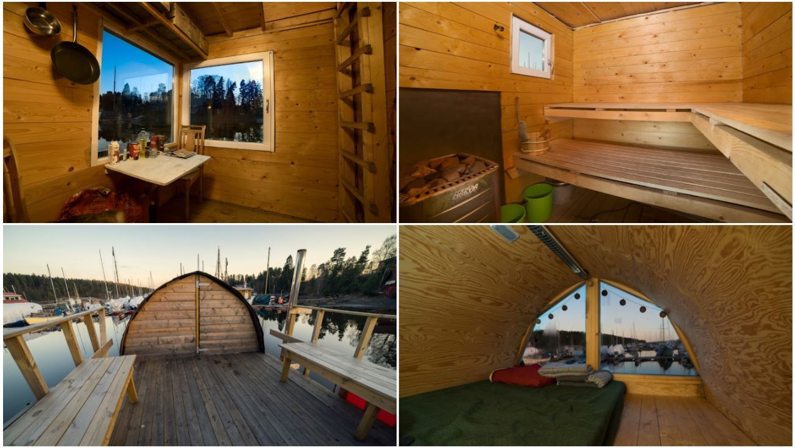

# Wasa_sauna
A floating sauna raft that [I](https://github.com/Jaknil) designed and built at [Fellesverkstedet](https://www.fellesverkstedet.no/) in Oslo.

## Links

[Google photos: Promotional pictures of Wasa Sauna](https://photos.app.goo.gl/A7ASr5p1Vt55GASh6)

[Google photos: Lots of pics of the build process](https://photos.app.goo.gl/7zRKsu3oAkMGb1CF9) (Feb - June 2014, will add more later) Thanks to all that helped!

[Youtube: Videos of its facilites](https://youtube.com/playlist?list=PLKSI6XgWmHYak1AXvxSxXbOTM4TtMFS2j)

[Youtube: Electric motor remote control demonstration](https://youtu.be/BcCw5NP7hio)

[3D models: Solidworks 2011 format, unsorted](drawings/Wasa_Sauna_Solidworks_files.zip)

[Teknisk Ukeblad: Norwegian article about the project](Wasa_Sauna_Tekniskt_Ukeblad.pdf)

[AirBnB: PDF copy of the ad](airbnb_ad.pdf) (Unlisted)

[AirBnB: PDF copy of all reviews](Airbnb_All_reviews.pdf)

[Slides: The initial project pitch and construction plan](presentations/Wasa_Sauna_Plans__construction_Breakdown.pdf)

[Slides: Construction breakdown, before extentions were added](presentations/Wasa_Sauna_built.pdf)

## Pictures

